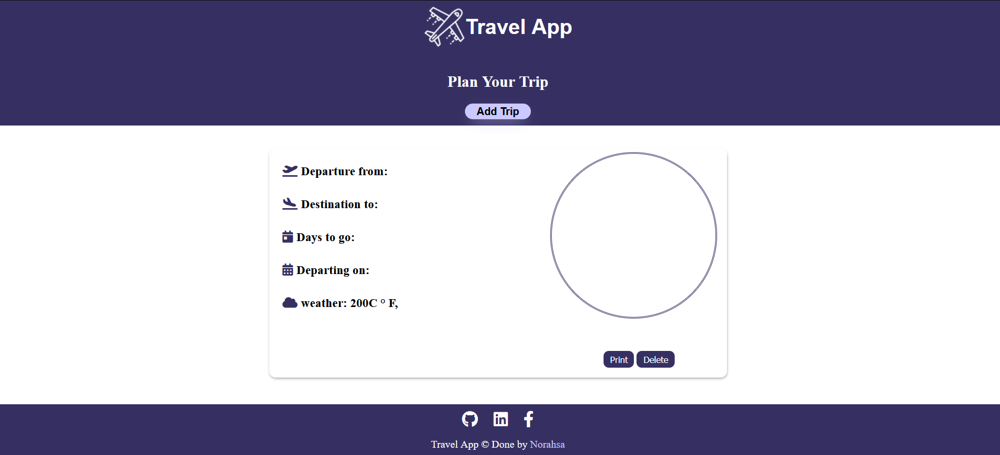
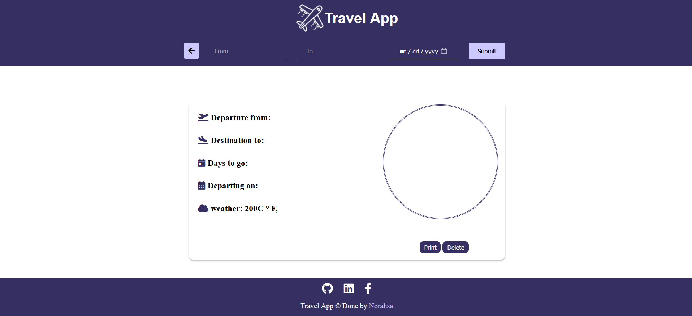
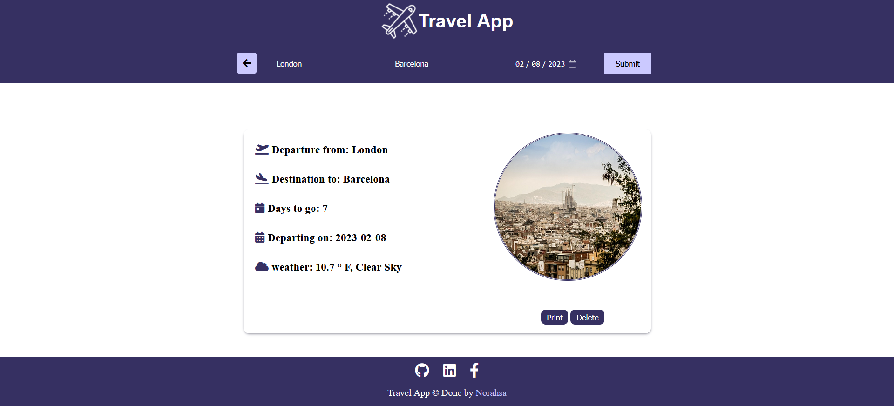

# Travel App Project


## Overview
This project will ask the user to enter the departure city , destination city , and date the user plan to travel in. The user will submit and will receive details about the trip. 

## Instructions
To install this project download zip file 
- To build dev 
```
npm run build-dev
```
- To build prod
```
npm run build-prod
```
- After build start 
```
npm start
```
## Project files
```shell script
- Root:
  - `.babelrc`
  - `.gitignore`
  - `package.json`
  - `package-lock.json`
  - `readme.md`
  - `webpack.dev.js`
  - `webpack.prod.js`
  - src folder
    - server folder
      - `index.js`  
    - client folder
      - `index.js`
      - html/views folder
        - `index.html`
      - js folder
        - `index.js` 
      - media folder
        -`bg.jpg`
      - styles folder
        - `style.scss` 

```
## Used API's

- GeoNames
- Weatherbit 
- Pixabay

## Screenshots





